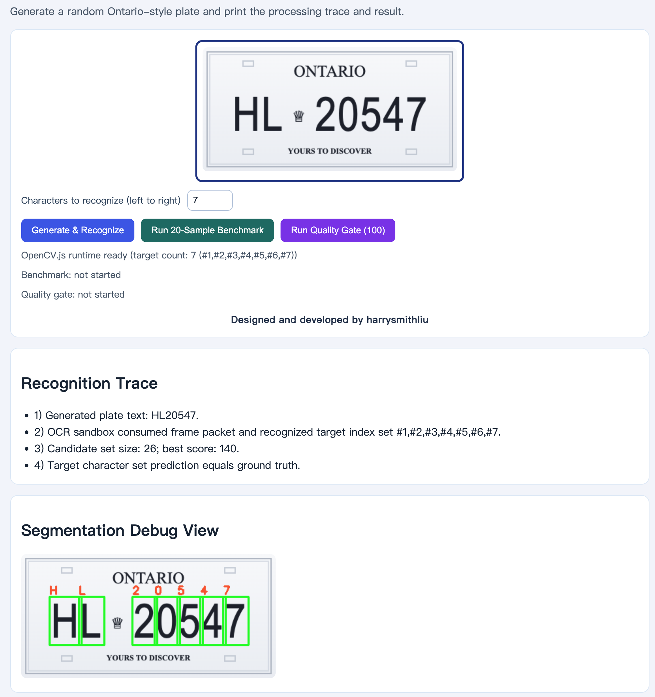
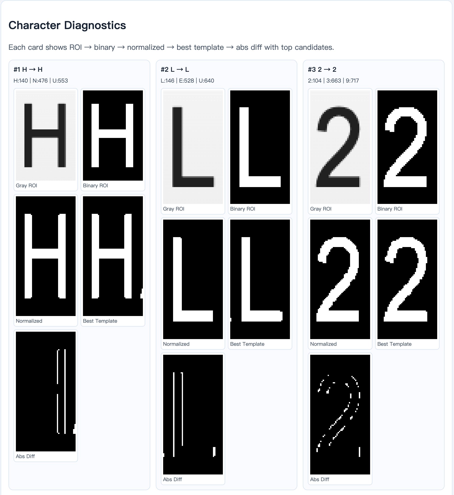
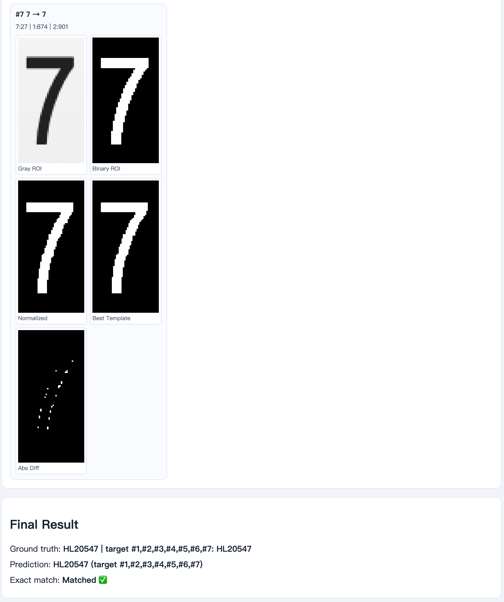

# Ontario Plate Recognition (OpenCV.js, GitHub Pages Ready)

This is a pure frontend demo that does not use the camera.  
The page generates a random Ontario-style plate (`LLDDDDD`), runs OpenCV-based processing, and prints both the recognition trace and final prediction.

## Implementation Path

1. Render a synthetic Ontario-style plate with `canvas`.
2. Preprocess the image with grayscale conversion and thresholding.
3. Crop the character band and run morphology to stabilize segmentation.
4. Detect character contours and sort candidates from left to right.
5. Match each character against `A-Z0-9` templates using pixel difference.
6. Show step-by-step logs, a debug view, and final match status.
7. Run a 20-sample benchmark for quick quality checks.
8. Run a 100-sample random quality gate plus a deterministic regression pack after changes.
9. Tune all recognition parameters from the centralized `TUNING` object in `app.js`.
10. Inspect per-character diagnostics (ROI, binary, normalized, best template, diff, top candidates).

## Sandbox Architecture (Renderer vs OCR)

The project now uses a two-sandbox structure so rendering and recognition remain decoupled:

- `PlateRenderer` sandbox:
  - Responsible only for drawing the full plate image.
  - Returns a frame packet (`image`, `groundTruth`, `anchors`) to downstream consumers.
  - Can be replaced by camera input in the future without changing OCR internals.

- `OCRPipeline` sandbox:
  - Consumes only frame packet data (`image` + optional `anchors`) and does not call rendering internals.
  - Handles ROI extraction, normalization, matching, diagnostics, benchmark, and quality-gate loops.
  - Supports low-coupling expansion from single-character mode to multi-character mode by updating target indices and evaluation settings in `TUNING`.

### Current Stage

- Milestone baseline is now fixed at full plate mode (`#1-#7`).
- Target count is still user-selectable (`1..maxSelectableCount`), but default startup is full 7-character recognition.
- Selector max is controlled by a single field: `TUNING.ocr.mode.maxSelectableCount`.

## Project Structure

```text
.
├── assets/
│   └── screenshots/
│       ├── 1.png
│       ├── 2.png
│       └── 3.png
├── index.html
├── styles.css
├── app.js
├── .gitignore
└── README.md
```

## Screenshots

### 1) Main Panel and Runtime Status

`assets/screenshots/1.png` shows the plate canvas, target-count selector (`1..7`), action buttons, and runtime/benchmark/quality-gate status lines.



### 2) Segmentation Debug View

`assets/screenshots/2.png` highlights left-to-right target selection with green boxes and per-box predicted characters drawn on the debug canvas.



### 3) Character Diagnostics and Final Result

`assets/screenshots/3.png` shows per-character diagnostic cards (`Gray ROI → Binary ROI → Normalized → Best Template → Abs Diff`) and the final ground-truth vs prediction summary.



## Local Run

A static server is recommended:

```bash
python3 -m http.server 8080
```

Then open `http://localhost:8080`.

## GitHub Pages Deployment

1. Push this folder (`image-extract`) to a GitHub repository.
2. In repository settings, open **Pages**.
3. Set source to the target branch (for example `main`) and root folder (`/root`).
4. Wait for the deployment to finish, then open the generated Pages URL.

## Current Status and Next Iterations

- Current pipeline is tuned for synthetic plates rendered by this demo.
- Built-in validation loop:
  - `Run 20-Sample Benchmark`: quick metric snapshot.
  - `Run Quality Gate (100)`: pass/fail gate on random samples + deterministic regression cases.
- Built-in tuning support:
  - All major parameters are centralized in `TUNING` (`app.js`).
  - Character diagnostics panel helps explain why each character was predicted.
- Regression protection:
  - Deterministic regression cases are defined in `TUNING.evaluation.regressionCases`.
  - These cases are rendered and re-checked on every quality gate run to catch refactor regressions early.
- Useful next upgrades:
  - Add perspective warp and random noise for harder samples.
  - Add fallback OCR (for example Tesseract.js) as a second recognizer.
  - Add confusion-matrix export for benchmark diagnostics.
